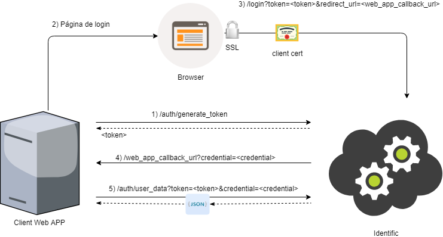

# eauth-identific-java-sample
Exemplo Java de utilização do serviço e-Auth Identific de autenticação via certificado digital

### Cadastrando para usar o serviço e-Auth Identific ###
 
1. Para a utilização do serviço e-Auth Identific é necessário o cadastramento do seu site em nosso ambiente, localizado no endereço https://identific.certificadodigital.com.br.
1. Clique no botão Inserir em meu site.
1. Complete o cadastro com os seus dados pessoais, da empresa que trabalha e da aplicação. 
1. Caso seja um cadastro para executar este exemplo insira em url de domiínio o seguinte endereço (http://localhost:8080) e em URL de redirecionamento (/autenticacao). 
1. Após este cadastro ser efetuado você receberá, em seu e-mail, um identificador e uma chave para o seu site. Tanto o identificador como a chave serão necessários para o uso do serviço e-Auth Identific. 

### Executando o exemplo ###

1. Tenha em mãos o identificador e a chave obtidos no cadastro da sua aplicação. Eles são necessários para a execução deste exemplo.   
1. Dentro do arquivo fonte IdentificSample.java inicialize o campo appID com o identificador, recebido por e-mail,
da sua aplicação.
1. dentro do arquivo fonte IdentificSample.java inicialize o campo apiKey com a chave, recebida por e-mail,
da sua aplicação.
1. Execute o IdentificSample.java
1. Acesse http://localhost:8080
1. Clique no botão e escolha o certificado a ser utilizado para autenticação
1. Após a autenticação o Identific redireciona o usuário para a url cadastrada para a applicação. No caso do exemplo a url será http://localhost:8080/autenticacao, que por sua vez, exibirá os dados do dono do certificado.

### Como funciona a API ###

A API do Identific realiza a autenticação do usuário através de 3 passos: Obtenção do token, redirecionamento para a autenticação no Identific, validação das credenciais/obtenção dos dados do usuário autenticado.



Obtenção do Token:

```sh
$ curl -X GET "https://identific.certificadodigital.com.br/api/v2/auth/generate_token" -H "Authorization: Bearer <Chave recebida por e-mail>"

```

Redireciona o usuário para o login no browser:

```
https://login-identific.certificadodigital.com.br/login?token=<generated_token>&appId=<Identificador da aplicação recebido por e-mail>
```

O Identific redireciona para <url_to_get_response>:

```
<url_to_get_response - Esta url foi a cadastrada para a aplicação>?credential=<credential>

```

Validar as credenciais e obter as informações do usuário:

```sh
$ curl https://identific.certificadodigital.com.br/api/v2/auth/user_data -d token=<token> -d credential=<credential> -H "Authorization: Bearer <Chave recebida por e-mail>" 
```

O Identific retorna o JSON com os dados do usuário e o status de validação do certificado:

```
{
	"status":"Certificado OK",
	"email":"JOAO.SILVA@BR.EXPERIAN.COM",
	"cpf":"12345678912",
	"name":"JOAO DA SILVA",
	"notBefore":1521752400000,
	"notAfter":1616360400000,
	"subjectCN":"JOAO DA SILVA:12345678912",
	"issuerCN":"AC SERASA RFB v5",
	"certificateType":"A3",
	"redirectUrl":"<url_to_get_response>",
	"aki":"ecf1415157a8e63ae95eb3a022f9088ab53a878f",
	"serialNumber":"98347489321",
	"token":"1d868b96-56d0-4572-a6c4-a952a10e8fd8",
	"certificateB64": "eyJhbGciOiJIUzUxMiJ9.eyJzdGF0dXMiOiJDZXJ0...",
	"idScore": 1000
}
```
